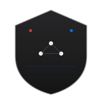

<p align="center">
  
</p>

<h1 align="center">CyberOrion 2.0</h1>

<p align="center">
  <em>自主红蓝对抗 · SUPER-AGENT 防御团队 · 客观评分体系</em>
</p>

<p align="center">
  
  
  
  
  
</p>

**一句话定位**：CyberOrion 是一个红蓝 LLM 真实对抗平台——红方 agent 自主渗透 docker 靶场，蓝方 SOC 团队对红方行动**一无所知**、只能靠遥测证据自主检测处置，每场对抗由服务端裁判与指标引擎客观评分（TP/FP/FN/检测率/MTTD，双方 0-100 分）。不是脚本演示，是可复现、可审计的 LLM 攻防。

## 30 秒精华

| 亮点 | 是什么 |
| --- | --- |
| **SUPER-AGENT 蓝队** | 指挥官 + `dispatch_task` 动态派遣 4 角色子代理（哨兵/研判/处置/狩猎），各角色独立 prompt + 最小工具子集，作战过程实时可见 |
| **真实裁判，不信嘴炮** | 红方"我成功了"必须经服务端裁判客观验证（外部评分器 `/done` > flag 比对 > `uid=` > 目标内部凭据）；红方每次工具调用自动落地面真值 |
| **信息隔离** | 蓝方代码层面接触不到 attacks 表/ground_truth（静态测试看守）；指标引擎把红方真值与蓝方告警做时间-主机-技术三维对齐 |
| **知识库 RAG** | 3204 条文档（ATT&CK v18 + Malpedia + 沙箱解读），embedding 检索 + BM25 离线回退，蓝队工具与 benchmark 同源复用 |
| **三大基准套件** | CyberSOCEval malware_analysis（609 题）+ attack_kb 知识访问测试 + CyberGym 真实漏洞 PoC 复现（官方提交服务器 + vul/fix 镜像客观判定） |
| **SOC 大屏前端** | 作战台（双终端 + 拓扑 + 时间线 + 实时评分）/ Benchmark / 历史复盘（AI 故事线）/ 知识图谱 四视图 |

---

## 手把手部署

> 以下命令在本项目实际运行环境（WSL2 + Docker Desktop）逐条验证过。路径按实际部署写，照抄即可。

### ① 前置条件

- **Docker Desktop 已启动**（WSL 里 `docker ps` 能通即 OK；不通就先启动 Windows 侧 Docker Desktop）；
- **Python 3.10+**（CAI 框架装在仓库外的虚拟环境 `/home/groy/cai/cai_env`，已存在可跳过 ②）；
- **一个 OpenAI 兼容端点的 API key**（MiniMax / DashScope / OpenAI 官方均可）；
- Node.js 20+ —— **仅重建前端时需要**，仓库自带构建好的 `web/dist`。

### ② Python 环境

```bash
# 已有环境（推荐，本项目实际使用）：
source /home/groy/cai/cai_env/bin/activate

# 或从零建（仓库没有 requirements.txt，依赖就这几样）：
python3.10 -m venv ~/cai_env && source ~/cai_env/bin/activate
pip install "cai-framework==0.5.10" fastapi uvicorn pyyaml numpy
```

### ③ 配置 .env

`.env` 放在 **CAI 仓库根**（`/home/groy/cai/.env`，不是 cyberorion/ 内）：

```bash
cp /home/groy/cai/cyberorion/.env.example /home/groy/cai/.env
```

关键变量（每个一行）：

| 变量 | 说明 |
| --- | --- |
| `CAI_MODEL` | 模型名，经 OpenAI 兼容端点接入时带 `openai/` 前缀，如 `openai/MiniMax-M3` |
| `OPENAI_API_KEY` | API 密钥 |
| `OPENAI_API_BASE` / `OPENAI_BASE_URL` | 端点地址（两个都写，BASE 优先）；OpenAI 官方则留空 |
| `CAI_GUARDRAILS=false` | 关掉 CAI 护栏，避免误拦对抗工具（只认字面值 `false`） |
| `CAI_TELEMETRY=false` | 关掉 CAI 自身的使用遥测 |

### ④ 起靶场 + 验证

```bash
cd /home/groy/cai/cyberorion
docker compose up -d        # web_basic 三靶机：dvwa(28080) / weak_ssh(22222) / log4j(8983)
docker compose ps           # 三台都是 Up 即就绪
```

### ⑤ 起服务

```bash
source /home/groy/cai/cai_env/bin/activate
set -a; source /home/groy/cai/.env; set +a   # server.py 也会自动加载，此步可省
python server.py             # → http://localhost:8000（API 文档在 /docs）
```

### ⑥ 第一次对局（点哪里、看什么）

1. **作战台**标签页：Header 左侧场景选 `web_basic`，点 **开始会话** —— 自动把靶场重置到易受攻击基线、启动遥测采集；
2. 点 **红方开始** —— 中间红方终端滚动 CoT 思考 + nmap/ssh/http 工具调用，战果经 `claim_success` 裁判验证（✓/✗ 进时间线）；
3. 点 **蓝方开始**（或 **自动巡逻**）—— 蓝方终端顶部出现**团队条**：指挥官派遣 watcher/analyst/responder/hunter 子代理时角色芯片依次点亮（执行中脉冲、完成绿✓，点击可按角色过滤），子代理报告以卡片形式插回输出流；
4. 左栏看拓扑与告警，右栏看时间线与**实时评分**；点 **结束会话** 自动产出 `report.md` + `metrics.json`；
5. 切到 **历史**标签页：选刚才的会话，看战役统计与完整时间线，点 **AI 复盘** 生成中文故事线报告；
6. 切到 **知识图谱**标签页：浏览蓝队同源的 ATT&CK 知识库。

**冒烟验证**（真实 LLM + docker 全链路硬断言；无 API key 自动 SKIP，不算失败）：

```bash
python scripts/e2e_smoke.py   # 遥测→红→蓝→评分链路
python scripts/e2e_fight.py   # 实战对抗：重置→红队打进→蓝队防守→真实战报
```

### ⑦ 跑 benchmark

UI：Benchmark 标签页选 base/rag + 题量 n → 实时进度 → 历史对比图 + 逐题详情。CLI：

```bash
python scripts/run_bench.py --n 100 --mode both                            # CyberSOCEval base+rag 对比
python scripts/run_bench.py --suite attack_kb --n 30 --mode both           # KB 访问能力测试
python scripts/run_bench.py --suite cybergym --n 5 --mode both --seed 42   # CyberGym 双臂（需先备环境，见下）
```

结果落盘 `logs/bench/<run_id>.json`。CyberGym 需先按 `/home/groy/cai/benchmarks/cybergym/RECON.md` 备数据与镜像（镜像拉取慢用同目录 `fast_pull.py`）。最新实测（n=100, seed=42, qwen3.7-max）：base 0.180/0.454，rag v6 0.190/0.451——完整结果史与局限见 [docs/BENCHMARK.md](docs/BENCHMARK.md)。

---

## 场景速览

场景切换三选一：UI Header 下拉框 / `POST /api/scenario/select` / 环境变量 `CO_SCENARIO`。

| 场景 | 靶机 | 启动方式 |
| --- | --- | --- |
| `web_basic`（默认） | DVWA、weak_ssh、Log4Shell Solr | `docker compose up -d` |
| `web_plus` | web_basic + WebGoat（28081）、VAmPI（25000） | `docker compose --profile web_plus up -d` |
| `cve_log4j` | 仅 Log4Shell Solr（CVE-2021-44228 专项） | `docker compose up -d` |
| `cve_cve-2024-4323` | CVE-Bench fluent-bit 靶栈 + 外部评分器 | `scripts/cve_target.sh up CVE-2024-4323` |

CVE-Bench 场景用 `scripts/gen_cve_scenario.py <CVE-ID> --variant one_day` 从 CVE 元数据生成；端口约定应用 9090 / 评分器 9091，**同一时间只跑一个 CVE 靶栈**。

---

## 故障速查

| 症状 | 处置 |
| --- | --- |
| `docker` 命令报错/连不上 | Docker Desktop 没起——启动 Windows 侧 Desktop，等 `/var/run/docker.sock` 出现 |
| 8000 端口被占 | `ss -tlnp \| grep 8000` 找占用；改端口编辑 `server.py::main()` 的 `port=8000` |
| 模型 401/超时/bench 全 0 | 先查端点与余额：`curl $OPENAI_BASE_URL/models -H "Authorization: Bearer $OPENAI_API_KEY"`；欠费会导致全 0，别先怀疑代码 |
| 前端白屏/样式旧 | 强制刷新（Ctrl+Shift+R）；仍异常则 `cd web && npm run build` 重建 |
| 靶机连不上/遥测无事件 | `docker compose ps` 确认三容器 Up；`docker logs cyberorion_weak_ssh` 看靶机日志 |
| 红队突然打不进 | 靶场被上一轮加固污染：`scripts/reset_targets.sh`（start_session 本会自动重置） |
| 镜像拉取慢/卡 0 B/s | CyberGym 用 `benchmarks/cybergym/fast_pull.py`；清掉 daemon.json 里失效的镜像加速器 |
| e2e 冒烟输出 SKIP | 降级不是失败：按打印的原因配 `.env` 或起 docker 后重跑 |

---

## 文档地图

| 文档 | 内容 |
| --- | --- |
| [AGENTS.md](AGENTS.md) | **AI 接管开发指南**：环境事实、代码地图、铁律、任务食谱、已知坑 |
| [docs/ARCHITECTURE.md](docs/ARCHITECTURE.md) | 架构深挖：模块地图、数据流、团队设计、信息隔离、评分公式、扩展指南 |
| [docs/BENCHMARK.md](docs/BENCHMARK.md) | 基准三套件：模式、跑法、评分、结果史、局限 |
| [docs/REVIEW.md](docs/REVIEW.md) | 评审/验收指南：测试、冒烟、产物审计、UI 检查单、故障排查 |
| [docs/CAI_IMPROVEMENTS.md](docs/CAI_IMPROVEMENTS.md) | 基于 CAI 框架做了什么（原生复用 vs 自建对照） |
| [web/README.md](web/README.md) | 前端开发说明 |

## Development

```bash
/home/groy/cai/cai_env/bin/python -m pytest tests/ -q   # 316 项测试，无 docker/key 也能全绿
```

`run.py` 是 legacy CLI 入口（旧同步回合制 Arena）：**不启动遥测与评分**——完整体验请用 `server.py`。

## License

MIT
